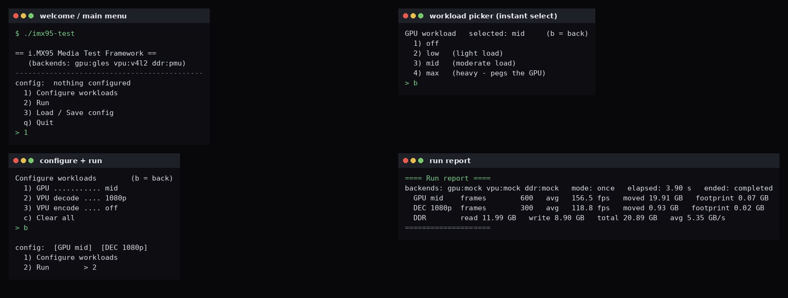
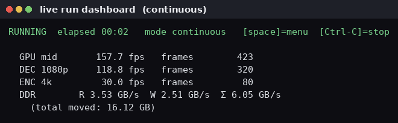
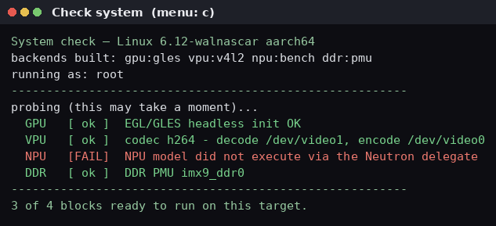
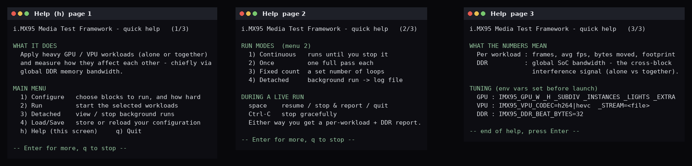
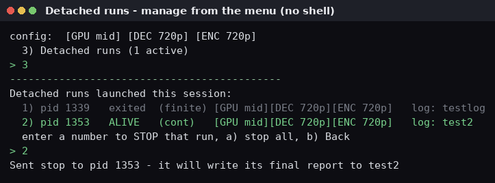
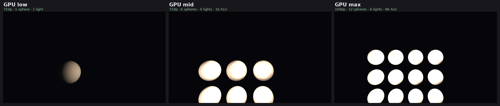
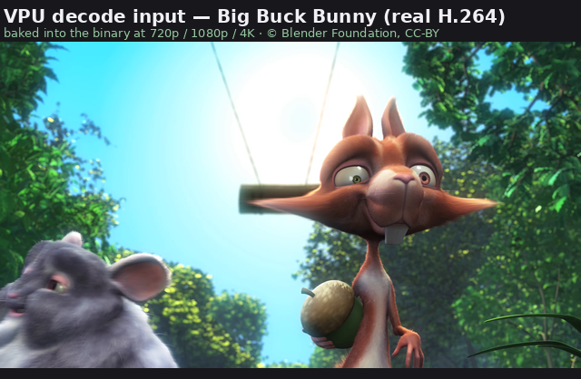

# imx95-media-test

An interactive, single-binary command-line harness for exercising **NXP i.MX95**
media/compute blocks — **GPU** and **VPU** today, **NPU** later — and measuring
how loading one block affects another.

The goal is not to benchmark a block in isolation. It is to answer the question
an SoC integrator actually asks:

> *If I max out the GPU and run a 4K VPU decode, what does that do to my other
> blocks, and to total DDR bandwidth?*

You pick some heavy workloads, run them together (or alone), and get per-workload
throughput plus the **global DDR memory-traffic** numbers that expose cross-block
interference.



During a run, a live dashboard shows each workload's fps and the rolling DDR
bandwidth; stop any time for a final report:



> **Status:** GPU, VPU, and the DDR monitor are all **running on real i.MX95
> silicon** (an i.MX95 EVK). Each subsystem's backend is selected independently
> at build time, and a full **mock** build runs the entire UI on any Linux host:
>
> | Subsystem | `mock` | real backend |
> |-----------|:------:|------|
> | GPU | ✅ | ✅ `gles` — EGL + GLES2, headless via GBM; host Mesa **and** i.MX95 Mali |
> | VPU | ✅ | ✅ `v4l2` — V4L2 mem2mem decode/encode; H.264 on the i.MX95 Wave VPU |
> | NPU | ✅ | 🔬 `bench` — eIQ Neutron via `benchmark_model` + delegate; needs a BSP-matched neutron-converted model |
> | DDR | ✅ | ✅ `pmu` — i.MX9 DDR perf counters via `perf_event_open` |
>
> NPU stack is wired and the Neutron delegate offloads on hardware; running a
> model end-to-end needs a `.tflite` neutron-converted with the converter
> version matching your board's BSP (see [`docs/BOARD.md`](docs/BOARD.md)). Also
> in progress: an optional on-screen GPU window.

## Quick start — try the UI in 30 seconds (no i.MX95 needed)

The all-mock build runs the complete interface anywhere — host, CI, or
`qemu-imx95` (which has no GPU/VPU). It simulates the workloads so you can learn
the menus, run loop, and reporting before touching hardware.

```sh
git clone https://github.com/kylefoxaustin/imx95-media-test
cd imx95-media-test
cmake -S . -B build
cmake --build build -j
./build/imx95-test
```

Then drive the menu (it mirrors the screenshots above):

1. `1` → **Configure workloads**.
2. `1` → GPU → `3` (mid) → `b`. Then `2` → VPU decode → `3` (1080p) → `b`. Then
   `b` back to the main menu. Selections apply instantly and are always shown;
   `b` goes back everywhere — no dead ends.
3. `2` → **Run** → `1` continuous, `2` once, `3` a fixed loop count, or `4`
   **detached → log file** (runs in the background so the terminal stays free).
4. Watch the live dashboard. Press **space** for a menu (resume / stop & report /
   quit), or **Ctrl-C** to stop gracefully. Either way you get a per-workload +
   DDR **run report**.

Not sure what your target supports? Press **`c`** for **Check system** — it
probes each block and tells you what's runnable here (and *why* something isn't),
before you run anything:



Press **`h`** at the main menu any time for a built-in, paginated quick-help
screen (it pauses between pages rather than scrolling off):



**Detached runs** let the harness run in the background while the terminal stays
free — start one with **Run → 4**, then list and stop them from **main menu →
Detached runs** (by number, or `a` for all; no shell needed):



On real hardware the experience is identical — you just build with the real
backends (see **Running on an i.MX95** below).

## What it exercises

| Block | Workload | Levels |
|-------|----------|--------|
| **GPU** (Arm Mali-G310) | Procedural EGL/GLES scene, complexity scaled by resolution × geometry × lights × shader cost | `low` / `mid` / `max` |
| **VPU** (Wave codec, V4L2 mem2mem) | Decode and/or encode | `720p` / `1080p` / `4k`, decode and encode independently |
| **NPU** (eIQ Neutron) | Looped quantized-TFLite inference via the Neutron delegate | on / off (supply a neutron-converted model) |

Decode and encode are independent (run both at once), but each is
single-resolution. The GPU level is a single choice.

## What the workloads look like

The GPU workload renders a procedural lit-sphere scene whose cost scales across
the levels — resolution, geometry, light count, and per-pixel shader work all
increase (these defaults are tuned for the Mali-G310 and are overridable with
`IMX95_GPU_*` env vars):



VPU **decode** runs real **Big Buck Bunny** content (baked into the binary at
720p/1080p/4K) so its frame rate is representative — synthetic frames compress to
almost nothing and decode unrealistically fast:



(VPU **encode** is fed procedurally generated raw frames; for an encode
throughput test the pixel content is irrelevant, only that frames change.)

> GPU frames captured headless with `IMX95_GPU_DUMP=<path.ppm>`.

## Running on an i.MX95

The deploy artifact is a single binary — see **[`docs/BOARD.md`](docs/BOARD.md)**
for the full build + run + bring-up guide. The short version, cross-compiling a
ready-to-upload binary with a generic aarch64 toolchain (no BSP sysroot needed —
the GLES backend `dlopen`s the Mali libs at runtime):

```sh
scripts/fetch-assets.sh        # fetch + transcode the Big Buck Bunny clips (once)
cmake -S . -B build-aarch64 -DCMAKE_TOOLCHAIN_FILE=cmake/aarch64-linux-gnu.cmake \
      -DIMX95_GPU=gles -DIMX95_VPU=v4l2 -DIMX95_DDR=pmu
cmake --build build-aarch64 -j
aarch64-linux-gnu-strip build-aarch64/imx95-test
# upload build-aarch64/imx95-test to the board and: sudo ./imx95-test
```

Run as **root** (the DDR PMU and codec/GPU nodes need it). Handy overrides:
`IMX95_VPU_CODEC=h264|hevc`, `IMX95_VPU_STREAM=<file.h264>`,
`IMX95_GPU_{W,H,SUBDIV,INSTANCES,LIGHTS,EXTRA,PASSES}`, `IMX95_DDR_BEAT_BYTES`,
`IMX95_DRM_DEVICE`. Details and a first-run checklist are in `docs/BOARD.md`.

## Build options

Backends are chosen per subsystem (`mock` default):

```sh
cmake -S . -B build -DIMX95_GPU=gles -DIMX95_VPU=v4l2 -DIMX95_DDR=pmu
```

- **`-DIMX95_GPU=gles`** — headless EGL + GLES2 (Mesa on a host, Mali on target).
- **`-DIMX95_VPU=v4l2`** — V4L2 stateful mem2mem codec; bakes in the BBB clips
  when `assets/clips/*.h264` exist (run `scripts/fetch-assets.sh`).
- **`-DIMX95_DDR=pmu`** — i.MX9 DDR PMU via `perf_event_open`.

### Exercise the V4L2 codec path on a host (no VPU)

The kernel's virtual stateful codec `vicodec` speaks the same uAPI as the Wave
VPU, so the decode/encode plumbing can be validated on a dev box:

```sh
sudo modprobe vicodec                        # creates /dev/videoN codec nodes
cmake -S . -B build-vpu -DIMX95_VPU=v4l2 && cmake --build build-vpu -j
IMX95_VPU_CODEC=fwht ./build-vpu/imx95-test  # vicodec uses the FWHT codec
```

### DDR bandwidth notes (`-DIMX95_DDR=pmu`)

Reads `fsl_imx9_ddr_perf` (sysfs `imx9_ddr0`), summing the read/write **beat**
counters (`eddrtq_pm_rd_beat_filt*` / `..._wr_beat_filt` on i.MX95). Needs root
(or `perf_event_paranoid <= 0`); falls back to an estimate when absent. Bytes =
beats × `IMX95_DDR_BEAT_BYTES` (default **32** — confirm against the RM).

## Design at a glance

- **Single self-contained binary.** It talks to the VPU directly via V4L2
  `mem2mem` ioctls (no GStreamer) and `dlopen`s the platform EGL/GLES libraries
  that ship on any i.MX95 BSP image — so it links no GPU libraries and needs no
  extra packages on the target.
- **Per-subsystem backend abstraction.** Every workload implements a small
  `Workload` interface; the DDR monitor implements `DdrMonitor`. Exactly one
  `mock` or real implementation is compiled per subsystem (`-DIMX95_GPU/VPU/DDR`),
  so real backends land incrementally and the CLI is developed/CI-tested without
  silicon.
- **DDR memory traffic is the headline metric.** Read from the i.MX9 DDR PMU
  (`perf_event_open`) on hardware. It is global to the SoC, which is exactly why
  it reveals one block stealing bandwidth from another.

See [`docs/DESIGN.md`](docs/DESIGN.md) for the architecture, module map, and
roadmap.

## Media assets

VPU decode uses **Big Buck Bunny** (© Blender Foundation, CC-BY 3.0).
`scripts/fetch-assets.sh` downloads the source and transcodes three
native-resolution H.264 Annex-B clips into `assets/clips/` (gitignored); the
build bakes them into the binary, so there is still only one file to deploy.

## Maintainer

Created and maintained by **Kyle Fox** ([@kylefoxaustin](https://github.com/kylefoxaustin)).

## License

BSD-3-Clause, © 2026 Kyle Fox. See [`LICENSE`](LICENSE). Bundled Big Buck Bunny
frames are CC-BY 3.0, © Blender Foundation.
